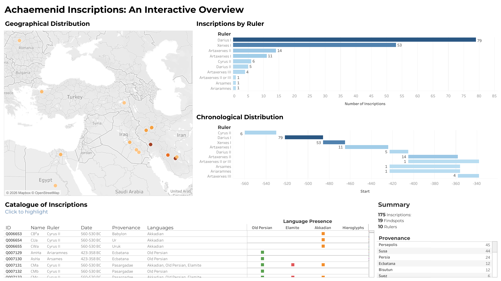
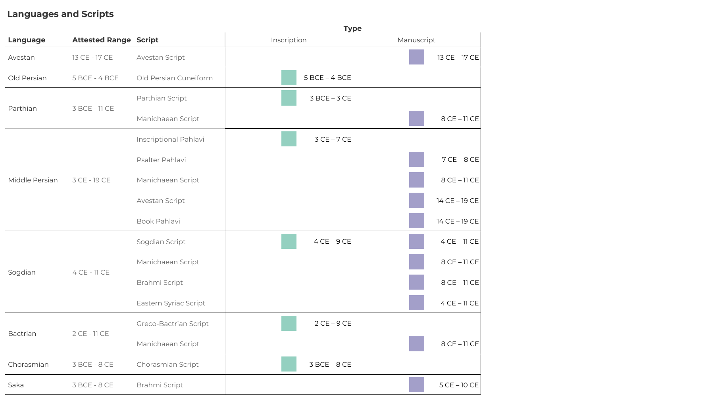
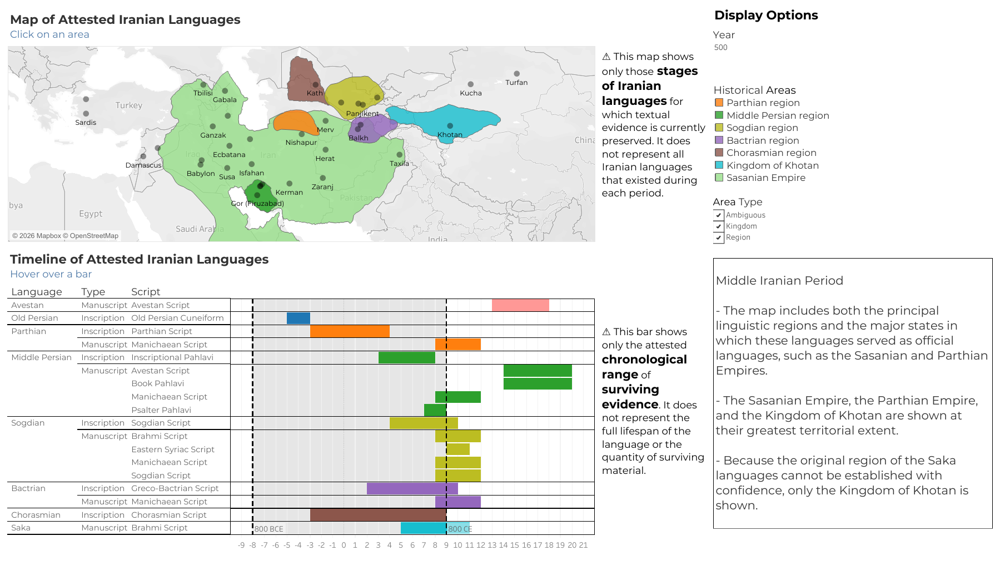

# Structuring Ancient Iranian Textual Data for Trismegistos
**Mahta Beigi — KU Leuven, August 2026**

This repository contains the data processing, datasets, and interactive visualisations developed for the Master's thesis *Structuring Ancient Iranian Textual Data for Trismegistos*, completed as part of the Advanced Master of Digital Humanities at KU Leuven.

The project examines how Ancient Iranian textual material can be identified, structured, and prepared for systematic integration into Trismegistos. The Old Persian material serves as a case study for data extraction, cleaning, standardisation, and restructuring.

## Repository Structure

### `old-persian-processing`

Contains the data and Python workflow used for the Old Persian case study:

- `data/` – source data used in the processing workflow
- `output/` – processed datasets produced by the workflow
- `old_persian_notebook.ipynb` – Jupyter Notebook containing the data processing and transformation steps

The Old Persian source data were obtained from the [Achaemenid Royal Inscriptions Online (ARIo)](https://oracc.museum.upenn.edu/ario/ARIoDownloads/index.html) project.

### `visualisations`

Contains the packaged Tableau workbooks (`.twbx`) developed for the project:

- **The Achaemenid Inscriptions Dashboard**
- **Comparative Overview of Iranian Languages**
- **Interactive Historical Map and Timeline of Iranian Languages**

Interactive versions of the visualisations are available on Tableau Public.

## Visualisations

### The Achaemenid Inscriptions Dashboard

[View interactive visualisation on Tableau Public](https://public.tableau.com/views/InteractiveHistoricalMapandTimelineofIranianLanguages/MapandTimeline)

  

### Comparative Overview of Iranian Languages

[View interactive visualisation on Tableau Public](https://public.tableau.com/views/ComparativeOverviewofIranianLanguages/ComparativeOverviewofIranianLanguages)

  

### Interactive Historical Map and Timeline of Iranian Languages

[View interactive visualisation on Tableau Public](https://public.tableau.com/views/AchaemenidInscriptionsAnInteractiveOverview/TheAchaemenidInscriptionsDashboard)

  

